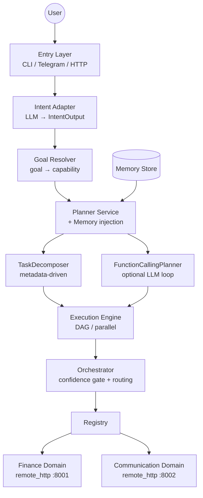

# Agent Orchestrator Layer

Multi-domain system oriented around goals, with intent extraction via LLM, metadata-driven planning, and deterministic DAG execution.

## Architecture Overview

```
User Input
  ↓ EntryRequest
Intent Adapter (LLM)
  ↓ IntentOutput { primary_domain, goal, entities{*_text / enum} }
Goal Resolver (deterministic)
  ↓ ExecutionIntent { domain, capability, parameters, confidence }
Planner Service + Memory
  ↓ ExecutionPlan { steps[], execution_mode, combine_mode }
Execution Engine (DAG)
  ↓ ExecutionIntent (per step)
Orchestrator (registry lookup)
  ↓
Domain Handler
  ↓ DomainOutput { status, result, explanation }
```

> Full details on each layer and payloads: **[ARCHITECTURE.md](./ARCHITECTURE.md)**

---

## Diagram



---

## Payloads per Layer

### EntryRequest

```python
EntryRequest(
    session_id="user-abc123",
    input_text="qual o preço da Nordea?",
    metadata={}
)
```

### IntentOutput (output of Intent Adapter)

The LLM extracts the **goal** and **human-friendly entities** — never technical tickers or IDs.

```python
IntentOutput(
    primary_domain="finance",
    goal="GET_QUOTE",
    entities={"symbol_text": "Nordea"},   # name as the user said it
    confidence=0.95,
    original_query="qual o preço da Nordea?"
)
```

```python
# Goal with enum (TOP_MOVERS)
IntentOutput(
    primary_domain="finance",
    goal="TOP_MOVERS",
    entities={"direction": "GAINERS", "market_text": "Brasil"},
    confidence=0.92,
    original_query="maiores altas do Brasil"
)
```

### ExecutionIntent (output of Goal Resolver)

Deterministic mapping of `goal + entities → capability`. No LLM.

```python
ExecutionIntent(
    domain="finance",
    capability="get_stock_price",          # resolved by GoalResolver
    parameters={"symbol_text": "Nordea"},  # entities become parameters
    confidence=0.95,
    original_query="qual o preço da Nordea?"
)
```

### ExecutionPlan (output of Planner)

```python
ExecutionPlan(
    execution_mode="dag",
    combine_mode="report",
    steps=[
        ExecutionStep(id=1, capability="get_stock_price",
                      params={"symbol_text": "Nordea"}, depends_on=[]),
        ExecutionStep(id=2, capability="send_telegram_message",
                      params={"message": "${1.explanation}"}, depends_on=[1], required=False)
    ]
)
```

### DomainOutput (output of Domain Handler)

```python
DomainOutput(
    status="success",        # "success" | "failure" | "clarification"
    result={
        "symbol": "NDA-SE.ST",
        "price": 112.5,
        "currency": "SEK",
        "_market_context": {"market": "SE", "exchange": "OMX"}
    },
    explanation="Nordea está em 112.50 SEK",
    confidence=1.0,
    metadata={}
)
```

---

## Project Structure

```text
AgentOrchestratorLayer/
├── main.py                          # Entry CLI + Telegram
├── api/openai_server.py             # OpenAI-compatible API (Open WebUI)
│
├── intent/adapter.py                # LLM → IntentOutput
│
├── planner/
│   ├── goal_resolver.py             # IntentOutput → ExecutionIntent (deterministic)
│   ├── service.py                   # orchestrates planner + memory
│   ├── task_decomposer.py           # metadata-driven step decomposition
│   └── function_calling_planner.py  # optional LLM loop
│
├── execution/
│   ├── engine.py                    # DAG executor + workflow runtime
│   ├── result_combiner.py           # combines step outputs
│   └── task_state_store.py          # persists TaskInstance + WorkflowEvent
│
├── orchestrator/orchestrator.py     # confidence gate + capability routing
│
├── registry/
│   ├── db.py                        # SQLite: domains, capabilities, goals
│   ├── loader.py                    # loads manifests → registry
│   ├── domain_registry.py           # in-memory HandlerRegistry
│   └── http_handler.py              # handler for remote_http domains
│
├── shared/
│   ├── models.py                    # all Pydantic models
│   └── workflow_contracts.py        # MethodSpec, WorkflowSpec, TaskInstance
│
├── memory/store.py                  # SQLiteMemoryStore
├── models/selector.py               # ModelSelector (Ollama/OpenAI-compat)
├── skills/                          # SkillGateway + MCP adapter
│
├── domains/
│   ├── finance/                     # Finance domain (see domains/finance/README.md)
│   └── general/handler.py           # General domain (chat)
│
├── communication-domain/            # Communication domain (see communication-domain/README.md)
│
├── scripts/                         # test and evaluation scripts
├── domains.bootstrap.json           # domain bootstrap configuration
└── docker-compose.yml
```

---

## Domains

Each domain has its own README with manifest, capabilities, and examples:

- **[Finance Domain](./domains/finance/README.md)** — quotes, top movers, screener, history
- **[Communication Domain](./communication-domain/README.md)** — sending via Telegram

---

## Key Features

- **Goal-based intent:** LLM extracts goal + human-friendly entities; GoalResolver maps to capability without LLM
- **Metadata-driven decomposition:** decomposition into parallel steps is configured in the manifest, not in code
- **DAG execution:** steps with explicit dependencies, parallel execution with `max_concurrency`
- **Declarative workflow:** `MethodSpec` + `WorkflowSpec` for flows with `human_gate`, `decision`, `validate`, `call`, `return`
- **Pause/resume:** `TaskInstance` persists state; `resume_task(ClarificationAnswer)` resumes from where it left off
- **Memory injection:** structured memory (SQLite) injected into the planner before decomposition
- **Symbol resolver:** Finance handler resolves names → tickers via alias metadata + `search_symbol` as fallback
- **Soft confirmation:** intents with `confidence < 0.94` return a clarification before executing
- **Streaming:** SSE with incremental status updates; fast-path with real token streaming for general chat
- **OpenAI-compatible API:** direct integration with Open WebUI

---

## Configuration

### Main variables

```bash
# LLM / Models
OLLAMA_URL=http://localhost:11434

# Remote domains
BOOTSTRAP_DOMAINS_FILE=domains.bootstrap.json

# Databases
DB_PATH=agent.db
REGISTRY_DB_PATH=registry.db
MEMORY_DB_PATH=memory.db

# Confidence
SOFT_CONFIRM_THRESHOLD=0.94

# Telegram entry
TELEGRAM_BOT_TOKEN=...
TELEGRAM_DEFAULT_CHAT_ID=...

# OpenAI API
OPENAI_API_DEBUG_TRACE=false
```

### Domain bootstrap (`domains.bootstrap.json`)

```json
[
  {
    "name": "finance",
    "type": "remote_http",
    "config": {"url": "http://finance-server:8001", "timeout": 90.0},
    "sync_capabilities": true
  },
  {
    "name": "communication",
    "type": "remote_http",
    "config": {"url": "http://communication-domain:8002", "timeout": 15.0},
    "sync_capabilities": true
  }
]
```

---

## How to Run

### Docker Compose

```bash
docker compose up --build
```

Services:
- `finance-server` → host `:8003`
- `communication-domain` → host `:8002`
- `agent-api` → host `:8010`
- `open-webui` → host `:3000`

### CLI

```bash
python3 main.py run
python3 main.py run-telegram
```

### API

```bash
uvicorn api.openai_server:app --host 0.0.0.0 --port 8010
```

Endpoints:
- `GET /health`
- `GET /v1/models`
- `POST /v1/chat/completions` (with `stream: true` for SSE)

### Admin

```bash
python3 main.py domain-list
python3 main.py domain-add finance remote_http '{"url":"http://localhost:8003"}'
python3 main.py domain-sync finance
python3 main.py memory-set preferred_market '"SE"'
python3 main.py memory-get preferred_market
```

---

## Tests

```bash
# unit tests
python3 -m pytest -q

# integration scripts
PYTHONPATH=. python3 scripts/test_stock_price_notify_simple.py
PYTHONPATH=. python3 scripts/test_telegram_send_simple.py

# capability evaluation (requires domains running)
FINANCE_DOMAIN_URL=http://localhost:8003 python3 scripts/evaluate_capabilities.py
```

---

## Troubleshooting

| Symptom | Likely cause | Solution |
|---------|--------------|---------|
| Too many clarifications | `SOFT_CONFIRM_THRESHOLD` too high | Lower to `0.85` |
| Wrong ticker | LLM inferred ticker directly | Check goal's `entities_schema` |
| `Name or service not known` for `finance-server` | Running outside compose | Use `http://localhost:8003` |
| Telegram not receiving messages | Bot has no initial message | Send a message to the bot first |
| Port conflict 8001 | Finance uses 8001 internally | Host port is 8003 in compose |

## License

MIT
