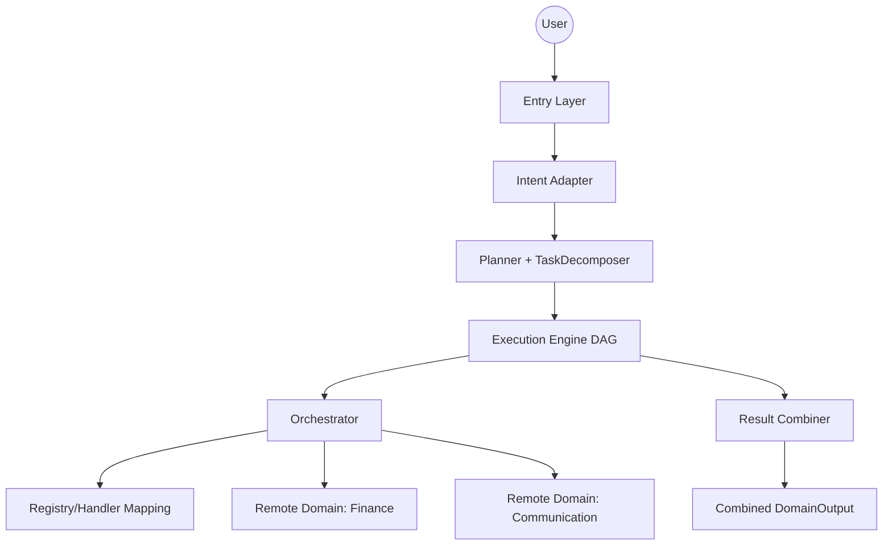

# Agent Orchestrator Layer

Multi-layer, multi-domain orchestrator with deterministic execution, LLM-based intent extraction, and remote domain integration via HTTP (`/manifest`, `/openapi.json`, `/execute`).

## What Was Added

- Real **TaskDecomposer** for multi-domain planning.
- **DAG/parallel execution engine** with dependency handling.
- **Combined output** for multi-step execution.
- New standalone **communication domain** (Telegram) in its own service/container.
- Dynamic domain injection via DB/bootstrap (no hardcoded finance/communication domains).
- Runtime capability discovery so the assistant can answer "what can you do?" by domain.

## Architecture



## Multi-Domain Flow (Example)

Query example:
- `pegue o preco da AAPL e envie no telegram`

Plan generated:
1. `finance.get_stock_price` (required)
2. `communication.send_telegram_message` (depends on step 1, optional)

Step parameter interpolation supported:
- `${1.explanation}`
- `${1.result.price}`
- `${ENV:TELEGRAM_DEFAULT_CHAT_ID}`

## Project Structure

```text
AgentOrchestratorLayer/
├── main.py
├── docker-compose.yml
├── domains.bootstrap.json
├── shared/
│   └── models.py
├── planner/
│   ├── service.py
│   └── task_decomposer.py
├── execution/
│   ├── engine.py
│   └── result_combiner.py
├── orchestrator/
│   └── orchestrator.py
├── registry/
│   ├── db.py
│   ├── loader.py
│   ├── http_handler.py
│   └── domain_registry.py
├── domains/
│   ├── finance/
│   └── general/
├── communication-domain/          # Standalone service (can live in separate repo)
│   ├── Dockerfile
│   ├── requirements.txt
│   └── app/
│       ├── main.py
│       ├── models.py
│       └── telegram_service.py
├── scripts/
│   ├── test_telegram_send_simple.py
│   └── test_stock_price_notify_simple.py
└── test_*.py
```

## Communication Domain (Standalone)

Path:
- `communication-domain/`

Endpoints:
- `GET /health`
- `GET /manifest`
- `GET /openapi.json`
- `POST /execute`

Capabilities:
- `send_telegram_message`
- `send_telegram_group_message`

Telegram env vars:
- `TELEGRAM_BOT_TOKEN`
- `TELEGRAM_DEFAULT_CHAT_ID`
- `TELEGRAM_DRY_RUN`
- `TELEGRAM_ALLOWED_CHAT_IDS`
- `TELEGRAM_TIMEOUT_SECONDS`

## Dynamic Domain Bootstrap (No Hardcode)

Domains are injected into `registry.db` at startup from:
1. `BOOTSTRAP_DOMAINS_JSON` (highest priority)
2. `BOOTSTRAP_DOMAINS_FILE`

Example `domains.bootstrap.json`:

```json
[
  {
    "name": "finance",
    "type": "remote_http",
    "config": {
      "url": "http://finance-server:8001",
      "timeout": 30.0
    },
    "sync_capabilities": true
  },
  {
    "name": "communication",
    "type": "remote_http",
    "config": {
      "url": "http://communication-domain:8002",
      "timeout": 15.0
    },
    "sync_capabilities": true
  }
]
```

## Configuration

### Agent env vars

- `OLLAMA_URL` (default: `http://localhost:11434`)
- `MCP_URL` (default: `http://localhost:8000/sse`)
- `DB_PATH` (default: `agent.db`)
- `REGISTRY_DB_PATH` (default: `registry.db`)
- `BOOTSTRAP_DOMAINS_JSON`
- `BOOTSTRAP_DOMAINS_FILE`
- `AUTO_SYNC_REMOTE_CAPABILITIES` (default: `true`)
- `SEED_CORE_DEFAULTS` (default: `true`)
- `SOFT_CONFIRMATION_ENABLED` (default: `true`)
- `SOFT_CONFIRM_THRESHOLD` (default: `0.96`) -> asks confirmation only when confidence is below this value
- `TELEGRAM_BOT_TOKEN` (required for Telegram entry channel)
- `TELEGRAM_ENTRY_POLL_TIMEOUT_SECONDS` (default: `20`)
- `TELEGRAM_ENTRY_REQUEST_TIMEOUT_SECONDS` (default: `35`)
- `TELEGRAM_ENTRY_ALLOWED_CHAT_IDS` (optional comma-separated allowlist for inbound Telegram messages)
- `TELEGRAM_ENTRY_DEBUG` (default: `true`) -> sends debug JSON messages for each pipeline layer in Telegram entry mode
- `TELEGRAM_ENTRY_DEBUG_MAX_CHARS` (default: `3200`) -> max JSON chunk size per debug message

### Communication domain env vars

- `TELEGRAM_BOT_TOKEN`
- `TELEGRAM_DEFAULT_CHAT_ID`
- `TELEGRAM_DRY_RUN` (default recommended: `true` for first runs)
- `TELEGRAM_ALLOWED_CHAT_IDS`
- `TELEGRAM_TIMEOUT_SECONDS`

## Run

### Docker (recommended)

```bash
docker-compose up --build
```

This starts:
- `finance-server` on `:8003` (container internal `:8001`)
- `communication-domain` on `:8002`
- `agent`
- `open-webui` on `:3000`
- `agent-api` on `:8010` (`/v1/models`, `/v1/chat/completions`)

### Open WebUI

Open WebUI is included in Docker Compose and can be used as a debugging console.

Access:
- `http://localhost:3000`

Default connection envs in compose:
- `OPENAI_API_BASE_URL` (default: `http://agent-api:8010/v1`)
- `OPENAI_API_KEY` (default: `sk-local-dev`)

If your OpenAI-compatible endpoint runs at a different URL, set it in `.env`:

```env
OPENAI_API_BASE_URL=http://host.docker.internal:8010/v1
OPENAI_API_KEY=sk-local-dev
```

Agent OpenAI-compatible endpoints:
- `GET http://localhost:8010/v1/models`
- `POST http://localhost:8010/v1/chat/completions`

### Entry channels

- CLI entry:

```bash
python3 main.py run
```

- Telegram entry (long polling):

```bash
python3 main.py run-telegram
```

## Simple Tests

### 1) Telegram send (communication domain only)

```bash
python3 scripts/test_telegram_send_simple.py
```

### 2) Stock price + Telegram notify (TaskDecomposer + DAG)

```bash
python3 scripts/test_stock_price_notify_simple.py
```

## Notes

- The communication domain is standalone and containerized separately. You can move `communication-domain/` to another repository without changing orchestrator architecture.
- Capability discovery is runtime-driven from registry/manifest, enabling domain-based responses for "what can you do?".

## License

MIT
