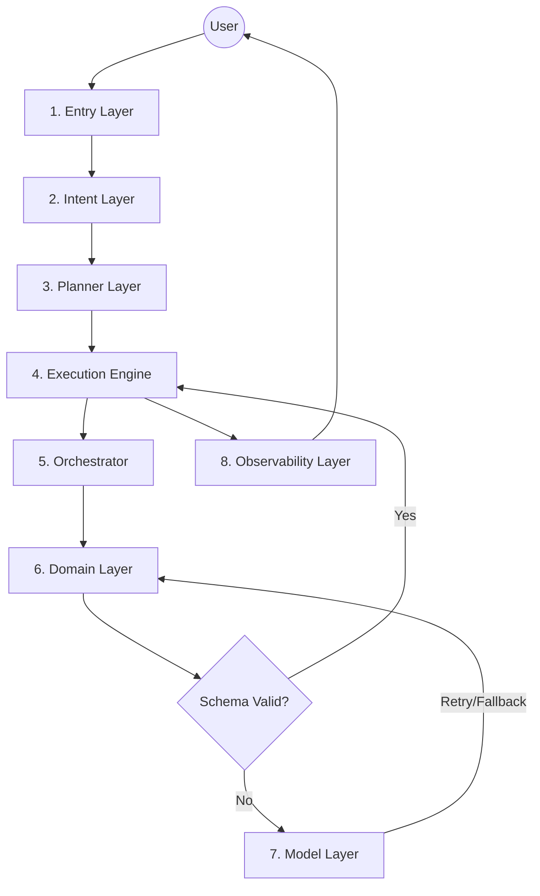

# 🤖 Agent Orchestrator Layer

Multi-layer, multi-domain agent orchestrator with **deterministic core** and **isolated LLM**. Built in Python, powered by [Ollama](https://ollama.ai) and integrated with [MCP Finance Server](https://github.com/douglashiga/MCP-Finance-Server).

## 📐 Architecture

### 8-Layer Reliability Architecture



### Layers Responsibilities

| Layer | Responsibility | Key Feature |
|-------|---------------|-------------|
| **1. Entry** | I/O Normalization | Protocol Agnostic (CLI/API) |
| **2. Intent** | Classification & Confidence | Strict `IntentOutput` Schema |
| **3. Planner** | Task Decomposition | Structured Execution Plans |
| **4. Execution** | Run Management | Timeouts, Dependencies, Parallelism |
| **5. Orchestrator** | Routing & Validation | Capability-based Routing (HandlerRegistry) |
| **6. Domain** | Business Logic | Isolated & Deterministic (`DomainOutput`) |
| **7. Model** | LLM Abstraction | Policies (Retry, Timeout, Fallback) |
| **8. Observability** | Insight & Debugging | Structured Logging & Metrics |

### Anti-Hallucination & Robustness Rules
 
 1. **Strict Schemas**: All LLM outputs must be valid JSON matching Pydantic models.
 2. **Confidence Gating**: Intents with confidence < 0.98 are rejected or trigger clarification.
 3. **No Logic in LLM**: Models only classify or format; they never execute business rules.
 4. **Timeouts**: Mandatory timeouts at Execution and Model layers.
 5. **Retries**: Max 3 schema validation retries before failure.
 6. **Capability Routing**: Routing based on specific capabilities (e.g., `get_stock_price`) rather than broad domains.
 
 ### Key Features
 
 - **Dynamic Domain Architecture**: Capabilities are loaded from a SQLite Registry, allowing "zero-code" integration of new tools via the Finance Server.
 - **Metadata-Driven Explanations**: Explanation templates are stored in the Registry, enabling dynamic, data-driven responses without code changes.
 - **Multilingual Context**: The system detects the user's language (e.g., Portuguese) from the original query and responds/clarifies accordingly.
 - **Context-Aware Clarification**: Ambiguous queries trigger specific follow-up questions (e.g., "Which market? US, BR, SE?"), and short answers (e.g., "BR") are correctly mapped to the context.

---

## 📦 Project Structure

```
AgentsOrchstratorLayer/
├── main.py                          # CLI entrypoint, wires all layers
├── pyproject.toml                   # Dependencies
├── Dockerfile                       # Docker image definition
├── docker-compose.yml               # Docker services orchestration
├── shared/
│   └── models.py                    # Pydantic models (IntentOutput, DomainOutput, etc.)
├── entry/
│   └── cli.py                       # CLI adapter
├── conversation/
│   └── manager.py                   # SQLite state manager
├── intent/
│   └── adapter.py                   # Ollama LLM intent extraction
├── planner/                         # (Phase 3) Task decomposition
├── execution/                       # (Phase 3) Execution engine
├── orchestrator/
│   └── orchestrator.py              # Capability-based router
├── registry/
│   └── domain_registry.py           # HandlerRegistry (Capabilities & Domains)
├── domains/
│   ├── general/
│   │   └── handler.py               # Conversational responses
│   └── finance/
│       ├── handler.py               # Finance domain orchestration
│       ├── context.py               # Market/currency resolver
│       └── core.py                  # Deterministic strategy engine
├── models/
│   └── selector.py                  # LLM Abstraction Layer
├── observability/
│   └── logger.py                    # Structured Logging
└── skills/
    ├── gateway.py                   # Controlled skill access
    ├── registry.py                  # Skill lookup
    └── implementations/
        └── mcp_adapter.py           # MCP Finance Server (SSE)
```

---

## 🚀 Installation & Running

### Prerequisites

- **Python 3.11+** (or Docker)
- **Ollama** with `llama3.1:8b` (Intent) and `qwen2.5-coder:32b` (Chat) models
- **MCP Finance Server** (running locally or in Docker)

### Option A: Local Python

1. **Clone & Install**:
   ```bash
   git clone https://github.com/douglashiga/AgentsOrchstratorLayer.git
   cd AgentsOrchstratorLayer
   pip install -r requirements.txt
   ```

2. **Setup Ollama**:
   ```bash
   ollama pull llama3.1:8b
   ollama pull qwen2.5-coder:32b
   ollama serve
   ```

3. **Run**:
   ```bash
   # Optional: Set MCP URL if different
   export MCP_URL="http://localhost:8000/sse"
   python main.py
   ```

### Option B: Docker (Recommended)

1. **Build & Run**:
   ```bash
   docker-compose up --build
   ```

   *Note: Ensure your MCP Finance Server is running and accessible. Update `docker-compose.yml` environment variables if needed.*

---

## 💬 Usage

```
╔══════════════════════════════════════════════════════════════════════════════════════════════ 🤖 ══════════════════════════════════════════════════════════════════════════════════════════════╗
║ Agent Orchestrator                                                                                                                                                                             ║
║ Intent: llama3.1:8b • Chat: qwen2.5-coder:32b                                                                                                                                                  ║
║ Type your question or 'exit' to quit                                                                                                                                                           ║
╚════════════════════════════════════════════════════════════════════════════════════════════════════════════════════════════════════════════════════════════════════════════════════════════════╝

You → qual o preço da AAPL?
🧠 Intent: domain=finance, capability=get_stock_price, symbol=AAPL, confidence=90%
✅ Result: AAPL is currently trading at 150.25 USD

You → exit
Goodbye! 👋
```

## ⚙️ Configuration

Configuration is managed via Environment Variables (with defaults in `main.py`).

| Variable | Default | Description |
|----------|---------|-------------|
| `OLLAMA_URL` | `http://localhost:11434` | URL for Ollama API |
| `MCP_URL` | `http://localhost:8000/sse` | URL for MCP Finance Server |
| `DB_PATH` | `conversations.db` | Path to SQLite database |

---

## 📄 License

MIT
